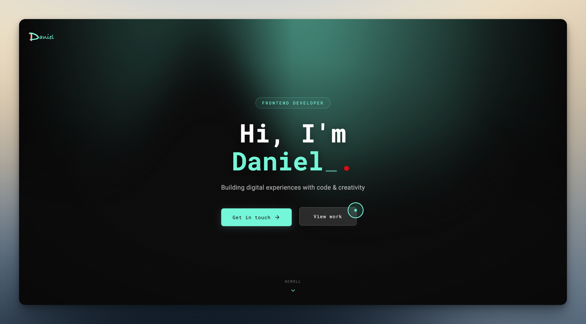

<div align="center">

<!-- HEADER -->


<!-- BADGES -->
<p>
<a href="https://danieldjupvik.dev"></a>
<a href="https://github.com/danieldjupvik/portfolio/stargazers"></a>
<a href="https://github.com/danieldjupvik/portfolio/commits"></a>
</p>

<p>


</p>

<br />

**A blazing-fast portfolio built with React 19 + React Compiler**

[**View Live →**](https://danieldjupvik.dev) &nbsp;•&nbsp; [**MovieWatcht**](https://danieldjupvik.dev/moviewatcht) &nbsp;•&nbsp; [**Daniel AI**](https://danieldjupvik.dev/ai)

<br />

<!-- PREVIEW -->
<a href="https://danieldjupvik.dev">

</a>

<sub>↑ Click to visit the live site</sub>

</div>

<br />

<!-- TABLE OF CONTENTS -->
<details>
<summary><b>📖 Table of Contents</b></summary>

- [Highlights](#-highlights)
- [Tech Stack](#-tech-stack)
- [Pages](#-pages)
- [Getting Started](#-getting-started)
- [Project Structure](#-project-structure)
- [Scripts](#-scripts)
- [Performance](#-performance)
- [Configuration](#-configuration)
- [Author](#-author)

</details>

---

## ⚡ Highlights

<table>
<tr>
<td width="50%">

### 🚀 Modern Stack

- **React 19** with React Compiler
- **TypeScript 5.9** for type safety
- **Vite 7** for lightning builds
- **React Router 7** with lazy loading

</td>
<td width="50%">

### 🎨 Design & UX

- Fluid responsive layouts
- Smooth page transitions
- WebGL effects with OGL
- Typewriter animations

</td>
</tr>
<tr>
<td width="50%">

### ⚙️ Developer Experience

- Hot Module Replacement
- Path aliases (`@/`, `src/`)
- SASS with BEM methodology
- ESLint + TypeScript strict

</td>
<td width="50%">

### 📊 Production Ready

- Vercel Analytics
- Optimized images
- Code splitting
- Edge-deployed on Vercel

</td>
</tr>
</table>

---

## 🛠️ Tech Stack

<table>
<tr>
<td align="center" width="96">

<br><sub><b>React 19</b></sub>
</td>
<td align="center" width="96">

<br><sub><b>TypeScript</b></sub>
</td>
<td align="center" width="96">

<br><sub><b>Vite 7</b></sub>
</td>
<td align="center" width="96">

<br><sub><b>SASS</b></sub>
</td>
<td align="center" width="96">

<br><sub><b>Vercel</b></sub>
</td>
<td align="center" width="96">

<br><sub><b>GitHub</b></sub>
</td>
</tr>
</table>

**Also using:** React Router 7 · React Compiler · Lucide Icons · OGL (WebGL) · Styled Components · Typewriter Effect · Vercel Analytics

---

## 🎨 Pages

| Route                  | Page               | Description                                                        |
| :--------------------- | :----------------- | :----------------------------------------------------------------- |
| `/`                    | **Portfolio**      | Hero with typewriter, projects showcase, skills grid, contact form |
| `/moviewatcht`         | **MovieWatcht**    | Landing page for the MovieWatcht mobile app                        |
| `/ai`                  | **Daniel AI**      | AI service page with features and capabilities                     |
| `/ai/privacy-policy`   | **Privacy Policy** | AI service privacy documentation                                   |
| `/ai/terms-of-service` | **Terms**          | AI service terms of service                                        |
| `/privacy`             | **Privacy**        | Main site privacy policy                                           |

---

## 🚀 Getting Started

### Prerequisites

```
Node.js  ≥ 20.x
npm      ≥ 10.x
```

### Installation

```bash
# Clone the repository
git clone https://github.com/danieldjupvik/portfolio.git

# Navigate to directory
cd portfolio

# Install dependencies
npm install

# Start development server
npm run dev
```

<details>
<summary>💡 <b>Using fnm?</b></summary>

<br />

The repo includes `.nvmrc` — fnm reads it automatically:

```bash
fnm use
```

Or enable auto-switching in your shell config:

```bash
# ~/.zshrc or ~/.bashrc
eval "$(fnm env --use-on-cd)"
```

</details>

<br />

> 🌐 **Development server:** [http://localhost:4500](http://localhost:4500)

---

## 📁 Project Structure

```
portfolio/
│
├── 📂 public/
│   ├── images/                 # Hero backgrounds, assets
│   └── *.png                   # Favicons, app icons
│
├── 📂 src/
│   ├── 📂 components/          # Reusable UI components
│   │   ├── Navigation/
│   │   ├── Hero/
│   │   ├── Projects/
│   │   └── ...
│   │
│   ├── 📂 pages/               # Route page components
│   │   ├── Home/
│   │   ├── MovieWatcht/
│   │   └── AI/
│   │
│   ├── 📂 hooks/               # Custom React hooks
│   ├── 📂 types/               # TypeScript definitions
│   │
│   ├── 📂 scss/
│   │   ├── partials/           # _variables, _mixins, _reset
│   │   └── *.scss              # Component styles
│   │
│   └── 📂 assets/              # Static imports (images, fonts)
│
├── 📂 api/                     # Vercel serverless functions
│
├── 📄 vite.config.ts           # Vite configuration
├── 📄 tsconfig.json            # TypeScript configuration
└── 📄 .nvmrc                   # Node version (works with fnm)
```

---

## 📜 Scripts

| Command              | Description                                        |
| :------------------- | :------------------------------------------------- |
| `npm run dev`        | Start Vite dev server on port 4500                 |
| `npm run dev:vercel` | Dev with Vercel environment & serverless functions |
| `npm run build`      | Create optimized production build                  |
| `npm run preview`    | Preview production build locally                   |
| `npm run deploy`     | Deploy to Vercel production                        |

---

## 🎯 Performance

- **React Compiler** — Automatic memoization, zero manual `useMemo`/`useCallback`
- **Code Splitting** — Lazy-loaded routes via `React.lazy()` + Suspense
- **Image Optimization** — Responsive hero images (desktop/mobile variants)
- **Tree Shaking** — Dead code elimination via Vite/Rollup
- **Edge Deployment** — Global CDN distribution via Vercel

---

## 🔧 Configuration

<details>
<summary><b>Environment Variables</b></summary>

<br />

Create `.env.local` for local development:

```env
VITE_API_URL=your_api_url
```

</details>

<details>
<summary><b>Path Aliases</b></summary>

<br />

Both `src/` and `@/` resolve to the source directory:

```tsx
import { Button } from 'src/components/Button';
import { useTheme } from '@/hooks/useTheme';
```

Configured in `vite.config.ts` and `tsconfig.json`.

</details>

<details>
<summary><b>Theme Variables</b></summary>

<br />

Core design tokens in `src/scss/_variables.scss`:

```scss
$background: #1d1d1d;
$navbar: #181818;
$accent: #74f7d9;
$font-heading: 'Roboto Mono', monospace;
$font-body: 'Roboto', sans-serif;
$max-width: 768px;
```

</details>

---

## 👤 Author

<div align="center">

<a href="https://danieldjupvik.dev">

</a>

### Daniel Djupvik

[](https://danieldjupvik.dev)
[](https://github.com/danieldjupvik)

</div>

---

<div align="center">


</div>
